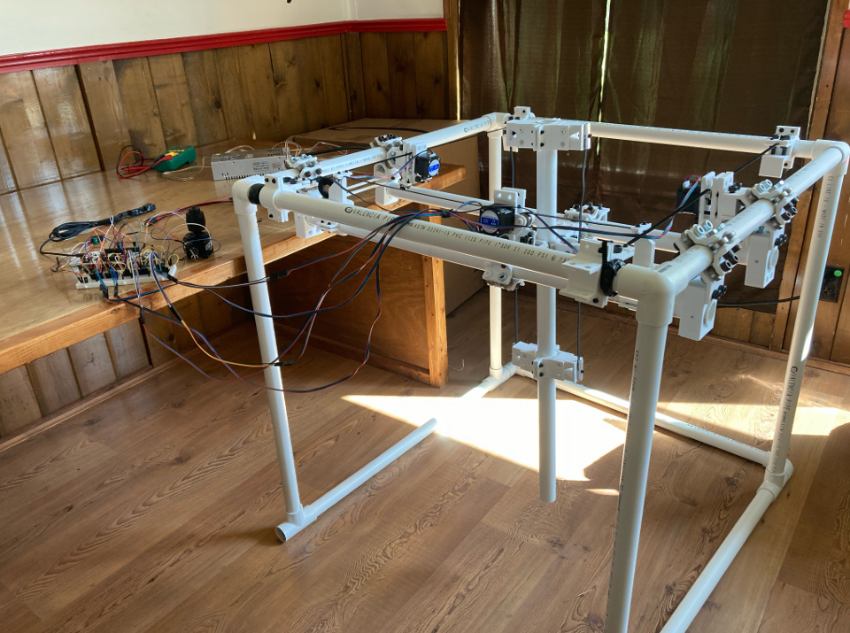
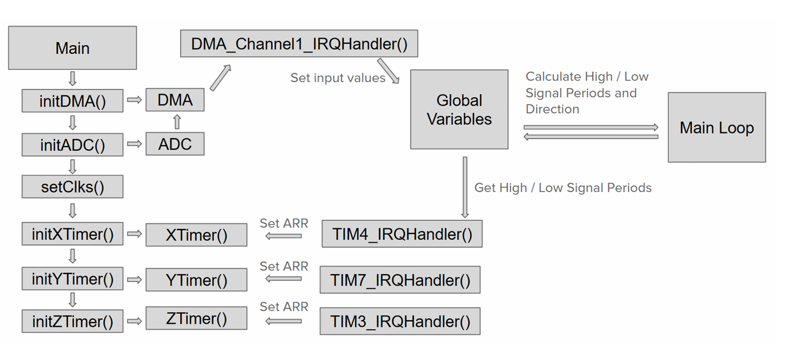
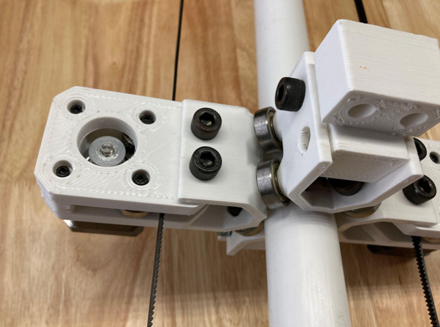
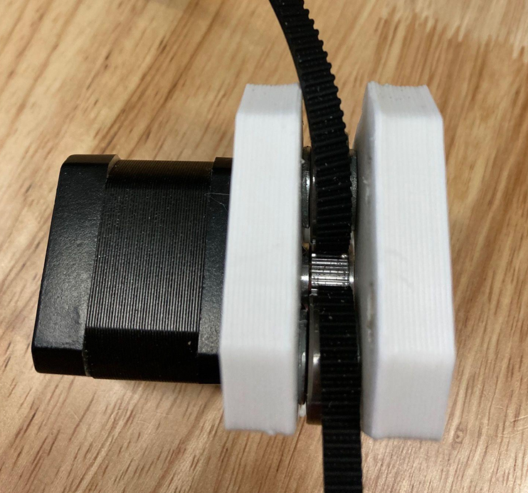
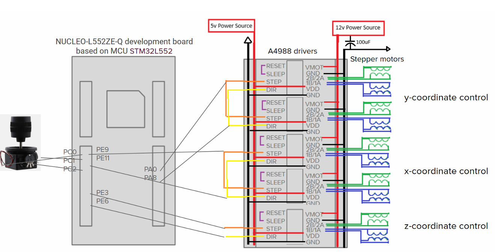
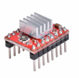
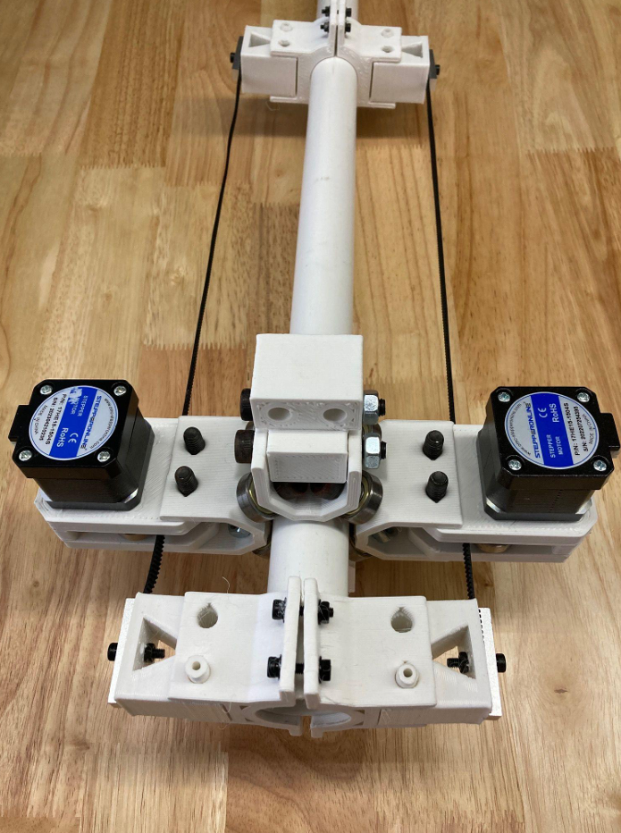

# cartesian-robot
This is a bare metal project using the STM32 NUCLEO-L552ZE-Q Development Board.

The robot is controlled by a 3 axis joystick, and driven by 5 a4988 stepper drivers and their accompanying 5 NEMA17stepper motors. It allows simultaneous movement in all directions, and has a
physical volume of 16 cubic feet. The end effector has a functional volume of 5 cubic feet.

The frame is assembled using PVC pipe and PVC pipe fittings. This served as a cheap means
of making a relatively large structure, however it resulted in many custom parts being required.
I ultimately used 608-ZZ Ball bearings bracketed around the PVC pipe
using 3d printed parts and M8 45mm length bolts. The axis are pulled around using GT2 timing belt attached to the stepper motors.

 \
A block diagram of the program flow.

 \
This is a close up of a linear motion assembly.\

 \
This is a close up of the belt routing around a gt2 pulley. The belt is routed around 608-ZZ bearings to increase contact area and prevent the belt from jumping teeth.

 \
This is a rudimentary wiring diagram for each component.

 \
This is one of the 5 a4988 stepper drivers used in the project. \

 \
This is the entire 'z' assembly when removed from the robot. \

